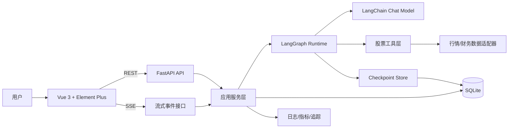
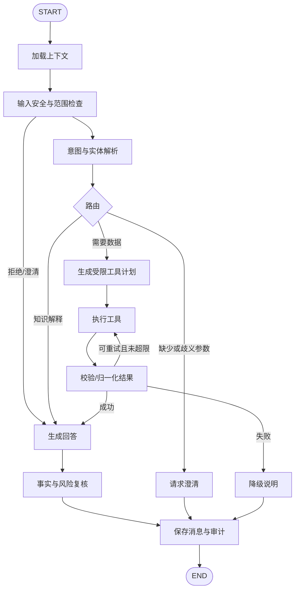
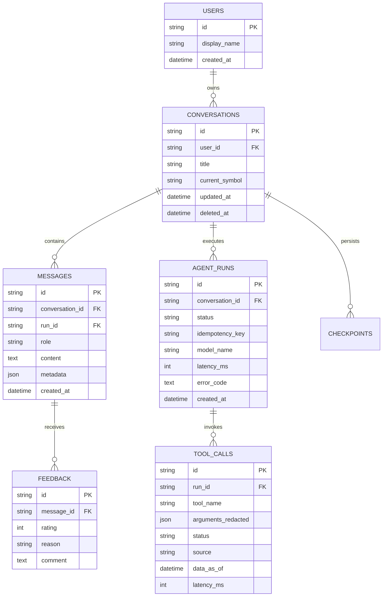
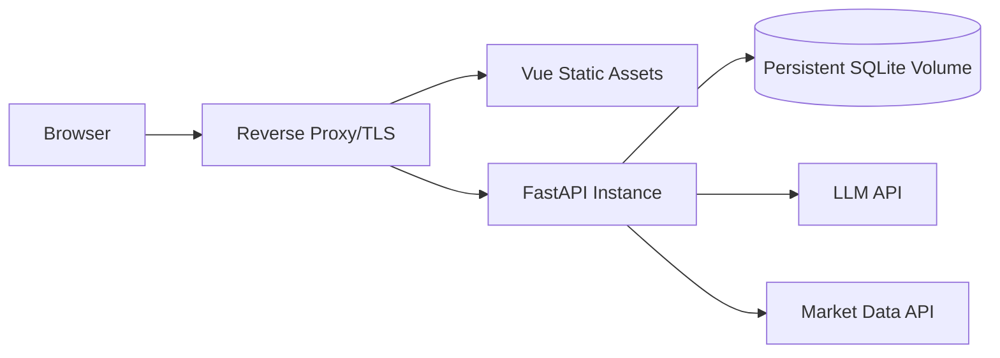

# 股票智能客服Agent 系统设计

> 文档状态：Draft v0.1  
> 技术栈：LangGraph + LangChain + FastAPI + SQLite + Vue 3 + Element Plus  
> 首版定位：面向 A 股的行情问答、公司信息查询、基础指标解释与风险提示；不执行交易，不承诺收益。

## 1. 建设目标

构建一个可追踪、可中断、可恢复的股票智能客服。用户可以使用自然语言询问股票行情、公司基本面、常见技术指标和市场概念，系统通过 LangGraph 编排意图识别、股票实体解析、工具调用、结果校验和答案生成，并以流式方式返回内容与执行状态。

首版重点不是做“全自动投资顾问”，而是建立可靠的 Agent 基座：

- 回答有数据依据，明确标注数据时间与来源。
- 涉及实时行情时必须调用工具，不能依赖模型记忆。
- 每次工具调用、状态变化和异常均可追踪。
- 对话可以持久化、恢复、取消和重新生成。
- 高风险问题有明确边界，不给出确定性收益承诺或代客决策。
- 行情供应商、模型供应商和存储实现均可替换。

## 2. 范围定义

### 2.1 MVP 功能

1. 用户与会话管理：匿名用户或简单账号、会话列表、历史消息。
2. 股票实体识别：支持代码、简称、全称，歧义时要求用户确认。
3. 行情查询：最新价、涨跌幅、开高低收、成交量、行情时间。
4. 公司信息：公司简介、所属行业、主要财务指标。
5. 指标解释：PE、PB、ROE、均线、MACD 等概念与使用限制。
6. 多轮问答：保留当前股票、时间范围、指标等上下文。
7. 流式输出：展示思考阶段的安全状态事件，而非模型隐含推理过程。
8. 反馈与审计：点赞/点踩、错误类型、工具调用记录、响应耗时。
9. 风险控制：敏感意图识别、免责声明、拒绝越界请求。

### 2.2 暂不纳入 MVP

- 自动下单、券商账户连接、资金操作。
- 个性化买卖建议和收益保证。
- 高频或低延迟交易系统。
- 复杂量化回测、组合优化和实盘跟单。
- 新闻全文版权内容的长期存储。

## 3. 关键设计原则

- **确定性优先**：股票代码解析、权限、参数校验和风险规则使用普通代码，不交给大模型自由判断。
- **数据新鲜度可见**：答案必须附带行情时间、数据来源和“是否延迟”标识。
- **工具输出不可信**：所有外部数据经过 schema 校验、单位归一化和异常检测。
- **状态显式化**：LangGraph State 只保存完成任务所需的结构化字段。
- **可降级**：行情源不可用时仍可回答知识类问题，并明确告知实时数据不可用。
- **前后端解耦**：REST 管理资源，SSE 传输单向流式事件；未来可平滑替换为 WebSocket。
- **合规默认开启**：任何投资相关回答都包含风险语境，避免确定性、煽动性表达。

## 4. 总体架构



### 4.1 后端分层

| 层 | 职责 | 主要对象 |
|---|---|---|
| API 层 | HTTP、鉴权、参数校验、SSE 输出 | FastAPI routers、Pydantic DTO |
| 应用层 | 会话、消息、反馈、运行生命周期 | ChatService、SessionService |
| Agent 层 | 状态图、路由、模型调用、错误恢复 | StateGraph、nodes、edges |
| 工具层 | 股票查询能力与统一返回结构 | QuoteTool、FundamentalTool |
| 数据源层 | 屏蔽不同供应商协议 | MarketDataProvider 接口 |
| 持久化层 | ORM、仓储、事务、迁移 | SQLAlchemy、Alembic、SQLite |
| 基础设施层 | 配置、日志、限流、可观测性 | settings、middleware、tracing |

### 4.2 前端分层

| 模块 | 职责 |
|---|---|
| views | 聊天页、历史会话页、设置页 |
| components | 消息气泡、股票卡片、工具状态、风险提示、输入框 |
| stores | 用户、会话、消息流、连接状态 |
| api | REST 客户端、SSE 事件解析、错误规范化 |
| composables | useChatStream、useConversation、useStockSymbol |
| types | API DTO、流事件、股票数据类型 |

## 5. LangGraph Agent 设计

### 5.1 状态定义

建议使用 `TypedDict` 定义最小状态：

```python
class AgentState(TypedDict, total=False):
    messages: Annotated[list[BaseMessage], add_messages]
    conversation_id: str
    run_id: str
    user_id: str | None
    intent: str
    symbols: list[str]
    time_range: dict[str, str] | None
    tool_results: list[dict]
    risk_level: str
    citations: list[dict]
    retry_count: int
    error: dict | None
```

注意：不要把访问令牌、数据库连接、完整用户画像或无关历史数据放入图状态。大对象应存数据库或对象存储，状态只保留引用。

### 5.2 图节点与路由



节点说明：

| 节点 | 实现方式 | 核心职责 |
|---|---|---|
| load_context | 代码 | 加载最近消息、会话摘要和当前股票上下文 |
| input_guard | 规则 + 小模型可选 | 识别越界请求、提示词注入和高风险表达 |
| classify | 结构化模型输出 | 输出固定 intent、symbols、时间范围、缺失参数 |
| plan_tools | 规则优先 | 只允许从工具白名单中选择，限制调用次数 |
| execute_tools | ToolNode/自定义节点 | 并发或串行调用，记录耗时与状态 |
| validate_results | 代码 | Pydantic 校验、时间/单位检查、异常值处理 |
| respond | 模型 | 基于验证后的工具结果生成简洁回答 |
| verify | 代码 + 模型可选 | 检查无来源数字、确定性承诺、数据时间缺失 |
| persist | 代码 | 原子化保存最终消息、运行状态和审计记录 |

### 5.3 意图枚举

```text
greeting              问候与能力咨询
market_quote          最新/历史行情
company_profile       公司与行业信息
financial_metrics     财务指标查询
indicator_explanation 指标或市场概念解释
comparison            多股票对比
follow_up             依赖上下文的追问
unsupported           超出系统能力
high_risk_advice      个性化买卖、收益承诺等高风险请求
```

### 5.4 工具契约

所有工具返回统一 envelope，避免模型直接消费供应商原始响应：

```json
{
  "ok": true,
  "data": {},
  "source": "provider_name",
  "as_of": "2026-09-02T14:30:00+08:00",
  "is_delayed": true,
  "latency_ms": 183,
  "error": null
}
```

首批工具：

- `resolve_stock(query)`：名称/代码解析，返回候选及交易所。
- `get_stock_quote(symbol)`：最新行情与行情时间。
- `get_price_history(symbol, start, end, interval)`：历史 K 线。
- `get_company_profile(symbol)`：公司、行业、主营业务。
- `get_financial_metrics(symbol, periods)`：标准化财务指标。
- `calculate_indicators(symbol, indicators, range)`：服务端确定性计算指标。

约束：工具参数由 Pydantic 严格校验；symbol 使用规范格式（如 `600519.SH`）；单轮工具调用数、查询跨度和返回行数均设上限；指标计算基于已校验行情，不由模型心算。

### 5.5 对话记忆

采用三层记忆：

1. **短期消息**：最近若干轮原始消息，用于保持语言连贯。
2. **会话摘要**：超过上下文阈值后生成结构化摘要。
3. **业务上下文**：当前股票、时间范围、用户刚确认的歧义项，独立字段存储。

LangGraph checkpoint 的 `thread_id` 使用 `conversation_id`，每次用户请求生成独立 `run_id`。运行失败时可以从已持久化 checkpoint 恢复，但最终消息写入要保持幂等。

## 6. 后端设计

### 6.1 推荐目录结构

```text
backend/
├── app/
│   ├── api/
│   │   ├── deps.py
│   │   └── v1/
│   │       ├── chat.py
│   │       ├── conversations.py
│   │       ├── feedback.py
│   │       └── health.py
│   ├── agent/
│   │   ├── graph.py
│   │   ├── state.py
│   │   ├── routing.py
│   │   ├── prompts/
│   │   └── nodes/
│   ├── tools/
│   │   ├── quote.py
│   │   ├── fundamentals.py
│   │   └── indicators.py
│   ├── providers/
│   │   ├── base.py
│   │   └── market_data.py
│   ├── services/
│   ├── repositories/
│   ├── models/
│   ├── schemas/
│   ├── core/
│   ├── db/
│   └── main.py
├── alembic/
├── tests/
│   ├── unit/
│   ├── integration/
│   └── evals/
├── pyproject.toml
└── .env.example
```

### 6.2 API 设计

基础路径：`/api/v1`

| 方法 | 路径 | 用途 |
|---|---|---|
| POST | `/conversations` | 新建会话 |
| GET | `/conversations` | 分页获取会话列表 |
| GET | `/conversations/{id}` | 获取会话详情 |
| PATCH | `/conversations/{id}` | 修改标题、归档状态 |
| DELETE | `/conversations/{id}` | 软删除会话 |
| GET | `/conversations/{id}/messages` | 分页获取历史消息 |
| POST | `/conversations/{id}/runs` | 创建一次 Agent 运行 |
| GET | `/runs/{run_id}/events` | 使用 SSE 接收运行事件 |
| POST | `/runs/{run_id}/cancel` | 取消仍在执行的运行 |
| POST | `/messages/{id}/feedback` | 提交反馈 |
| GET | `/health/live` | 存活检查 |
| GET | `/health/ready` | 数据库、模型、行情源就绪检查 |

创建运行请求：

```json
{
  "message": "贵州茅台今天涨了多少？",
  "client_request_id": "0194...",
  "attachments": []
}
```

响应使用 `202 Accepted`：

```json
{
  "run_id": "0194...",
  "conversation_id": "0194...",
  "status": "queued",
  "events_url": "/api/v1/runs/0194.../events"
}
```

### 6.3 SSE 事件协议

事件只传输可公开的运行状态，不暴露 chain-of-thought：

```text
event: run.status
data: {"run_id":"...","status":"running","stage":"fetching_market_data"}

event: message.delta
data: {"run_id":"...","content":"截至今日 14:30，"}

event: tool.result
data: {"name":"get_stock_quote","status":"success","source":"...","as_of":"..."}

event: message.completed
data: {"message_id":"...","usage":{"input_tokens":0,"output_tokens":0}}
```

事件类型：`run.status`、`tool.started`、`tool.result`、`message.delta`、`message.completed`、`run.error`、`run.cancelled`、`heartbeat`。每个事件包含递增 `sequence`；服务端支持 `Last-Event-ID`，前端重连后从断点续传或回查最终消息。

### 6.4 错误响应

统一使用问题详情结构：

```json
{
  "type": "https://example.local/problems/rate-limit",
  "title": "请求过于频繁",
  "status": 429,
  "detail": "请稍后重试",
  "code": "RATE_LIMITED",
  "request_id": "...",
  "retry_after": 10
}
```

禁止把堆栈、模型密钥、供应商原始报文返回给前端。

## 7. 数据模型

建议使用 UUIDv7/ULID 作为公开 ID；数据库内所有时间存 UTC，API 按 ISO 8601 返回带时区时间。



实现要点：

- SQLite 开启 WAL、foreign keys 和 busy timeout。
- API 使用短事务，不在数据库事务中等待模型或行情接口。
- 对 `messages(conversation_id, created_at)`、`agent_runs(conversation_id, created_at)` 和幂等键建立索引。
- JSON 字段用于非核心扩展元数据；需要查询和约束的字段必须正规化。
- 删除会话默认软删除；另设数据保留与彻底清理任务。
- 使用 Alembic 管理迁移，不依赖运行时自动建表。

## 8. 前端设计

### 8.1 推荐目录结构

```text
frontend/
├── src/
│   ├── api/
│   ├── assets/
│   ├── components/
│   │   ├── chat/
│   │   └── stock/
│   ├── composables/
│   ├── layouts/
│   ├── router/
│   ├── stores/
│   ├── types/
│   ├── utils/
│   ├── views/
│   ├── App.vue
│   └── main.js
├── tests/
├── package.json
└── vite.config.js
```

### 8.2 聊天页布局

- 左侧：新建会话、历史会话、归档与删除。
- 中间：消息列表、股票行情卡片、来源和数据时间、运行阶段、重试按钮。
- 底部：自适应输入框、停止生成、示例问题。
- 右侧可选：当前股票上下文、风险提示和引用详情。

### 8.3 前端状态机

```text
idle -> submitting -> connecting -> streaming -> completed
                              |-> reconnecting -> streaming
                              |-> failed -> retrying
streaming -> cancelling -> cancelled
```

关键体验：

- 先把用户消息以 pending 状态插入本地列表，服务端确认后替换 ID。
- 流式内容批量刷新，避免每个 token 都触发昂贵渲染。
- 页面刷新后根据 `run_id` 恢复运行状态。
- 股票数据用结构化卡片渲染，原始 Markdown 只用于解释文本。
- Markdown 禁止任意 HTML，并对链接、代码块和复制行为做安全处理。
- 键盘操作、色彩对比和移动端布局纳入验收。

## 9. 安全、隐私与合规

### 9.1 Agent 安全

- 系统提示词与工具规则由服务端持有，用户输入永远视为不可信数据。
- 外部新闻、网页或工具文本可能包含提示词注入，不允许覆盖系统规则。
- 工具白名单、参数 schema、超时、最大重试和最大调用数由代码控制。
- 模型输出不得直接拼接为 SQL、文件路径或系统命令执行。
- 对答案中的价格、比例、日期做来源绑定；无工具依据的实时数字应阻止输出。

### 9.2 Web 安全

- 密钥仅存后端环境变量或密钥服务，禁止进入前端包、日志和数据库明文。
- 鉴权后使用资源所有权校验，避免通过 ID 读取其他用户会话。
- 配置明确的 CORS allowlist、请求体上限、速率限制和超时。
- 记录 request_id/run_id，但对日志中的用户输入、令牌和敏感信息脱敏。
- 如果使用 Cookie 会话，启用 HttpOnly、Secure、SameSite 并防护 CSRF。

### 9.3 投资场景边界

系统可以提供事实数据、教育性解释和中性比较，但不应：

- 保证上涨、收益率或“必赚”。
- 冒充持牌投资顾问。
- 在不了解用户完整情况时给出个性化仓位或买卖指令。
- 隐藏数据延迟、来源缺失和不确定性。

推荐答案尾注：

> 以上内容仅用于信息与教育目的，不构成投资建议。市场有风险，决策前请核验最新数据并结合自身风险承受能力。

正式上线前应由目标运营地区的法律与合规人员审核文案、数据许可、隐私政策和功能边界。

## 10. 可观测性与质量评估

### 10.1 核心指标

- API：请求量、P50/P95/P99 延迟、4xx/5xx、SSE 断线率。
- Agent：图节点耗时、工具成功率、平均工具调用数、重试率、取消率。
- 模型：首 token 延迟、token 使用量、结构化输出失败率。
- 业务：问答完成率、澄清率、反馈满意度、无答案率。
- 数据：行情新鲜度、供应商异常率、无来源数字拦截数。

### 10.2 测试策略

| 类型 | 覆盖内容 |
|---|---|
| 单元测试 | 路由条件、股票代码解析、风险规则、指标计算、schema 校验 |
| 集成测试 | API + SQLite、checkpoint 恢复、SSE 顺序、供应商 mock |
| 图测试 | 每条边、工具失败、澄清、中断、重试上限、幂等性 |
| 评估集 | 典型问答、歧义股票、过期数据、注入攻击、高风险建议 |
| 前端测试 | store、事件解析、断线重连、取消、错误展示 |
| E2E | 创建会话到完成回答的主路径和降级路径 |

评估集应版本化。建议至少定义：意图准确率、实体解析准确率、工具选择准确率、引用完整率、事实一致性、合规通过率和端到端成功率；发布前设置最低门槛。

## 11. 配置建议

`.env.example` 只提供键名和安全默认值：

```dotenv
APP_ENV=development
APP_HOST=127.0.0.1
APP_PORT=9010
DATABASE_URL=sqlite+aiosqlite:///./data/stock_agent.db

LLM_PROVIDER=
LLM_MODEL=
LLM_API_KEY=
LLM_TIMEOUT_SECONDS=30

MARKET_DATA_PROVIDER=
MARKET_DATA_API_KEY=
MARKET_DATA_TIMEOUT_SECONDS=10

CORS_ORIGINS=http://localhost:6173
LOG_LEVEL=INFO
```

配置启动时校验；生产环境缺少密钥应直接启动失败。不要在文档、提交记录或示例响应中放置真实密钥。

## 12. 开发与部署方案

### 12.1 本地开发

- 前端 Vite 开发服务器通过代理访问 FastAPI，减少本地 CORS 配置。
- 后端和前端分别维护依赖锁文件。
- 行情工具提供 deterministic fake provider，便于离线开发和稳定测试。
- 提交前运行 lint、类型检查、单元测试和 Agent 评估小集合。

### 12.2 首版部署



SQLite 适合单实例 MVP。若出现多实例写入、后台任务增加、并发写锁明显或需要高可用，应迁移到 PostgreSQL；SSE 多实例部署时还需要共享运行状态/事件总线（如 Redis）。不要在多个容器间共享普通 SQLite 文件作为并发数据库。

## 13. 分阶段实施计划

### Phase 0：工程基线（1～2 天）

- 初始化 backend/frontend、配置管理、日志、数据库迁移和 CI。
- 建立统一错误、request_id、健康检查。
- 使用 fake provider 打通前后端。

### Phase 1：最小聊天闭环（3～5 天）

- 会话、消息、Agent run 数据模型与 API。
- LangGraph 基础图、知识问答、SSE 流式返回。
- 聊天页面、历史会话、取消与错误状态。

### Phase 2：股票工具闭环（4～7 天）

- 股票解析、行情、公司信息、财务指标工具。
- 数据校验、来源与时间展示、缓存和超时降级。
- 歧义澄清与多轮上下文。

### Phase 3：安全与质量（3～5 天）

- 输入防护、投资场景风险规则、输出验证。
- 评估集、追踪、指标、反馈与审计。
- 断线恢复、幂等、压力测试和故障演练。

### Phase 4：上线准备（2～4 天）

- 数据许可、隐私、免责声明和合规审核。
- 备份恢复、限流、告警、运行手册。
- 灰度发布并依据真实反馈扩充评估集。

## 14. 关键验收标准

MVP 完成需同时满足：

- 用户可创建会话并获得稳定的流式回复。
- 所有实时行情数字均能看到数据源和数据时间。
- 股票名称歧义不会静默选错，系统会请求确认。
- 工具超时或失败时给出明确降级回答，不伪造数据。
- 刷新页面可恢复历史消息；重复请求不会生成重复最终消息。
- 停止生成能终止或忽略后续事件并正确落库状态。
- 越界投资请求触发风险边界，普通教育问答不过度拒绝。
- 核心图路径、API、SSE 与前端主流程均有自动化测试。
- 生产构建不包含模型或行情服务密钥。

## 15. 待确认决策

以下决策会影响后续实现，建议在 Phase 0 确认：

1. 首发市场仅 A 股，还是同时支持港股/美股。
2. 行情/财务数据供应商及其授权、频率和延迟限制。
3. 使用的模型供应商、数据出境要求与预算上限。
4. 是否要求账号登录，还是先使用匿名设备会话。
5. 是否需要新闻检索、公告检索和来源链接。
6. 目标并发量、数据保留周期、部署环境和合规运营地区。

## 16. 下一步建议

按 Phase 0 开始创建工程骨架，同时先实现 fake market data provider。这样可以在不等待行情账号和模型选型的情况下打通数据库、LangGraph、SSE 与 Vue 聊天界面；真实供应商确认后只替换 provider 适配器并补充契约测试。
